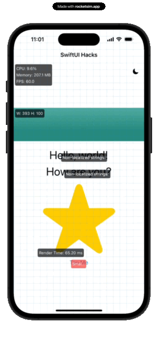

### SwiftUI Modifiers Collection

This collection contains several custom SwiftUI modifiers designed to enhance app development by providing easy-to-use tools for common tasks such as performance monitoring, accessibility checks, and UI customization.

	

---

#### **1. ColorSchemeSwitcher Modifier**
This modifier enables switching between light and dark color schemes in a SwiftUI view. It includes a button that toggles the color scheme between `.light` and `.dark`. The button is overlaid in the top-right corner of the view, allowing users to manually change the app's appearance.

---

#### **2. LocalizationHelper Modifier**
This modifier inspects the view hierarchy and detects non-localized strings within the SwiftUI views. It overlays a list of detected non-localized strings on the UI, allowing developers to easily spot and fix localization issues during development.

---

#### **3. RenderTime Modifier**
This modifier tracks and displays the time taken to render each SwiftUI view. By measuring the rendering time, developers can optimize the performance of specific views in their applications.

---

#### **4. LayoutGuides Modifier**
This modifier visually displays layout guides on a SwiftUI view, showing the edges and centers. It helps developers ensure that their view elements are properly aligned and positioned according to the layout guides.

---

#### **5. SizeDisplay Modifier**
This modifier shows the current size (width and height) of the SwiftUI view. It is helpful when dynamically resizing views or ensuring that the views fit properly within the available space.

---

#### **6. AccessibilityInspector Modifier**
This modifier enhances accessibility testing by overlaying important accessibility properties on top of the SwiftUI view. It helps ensure that the app meets accessibility standards, such as providing appropriate labels and traits for elements.

---

#### **7. PerformanceMetrics Modifier**
This modifier displays real-time performance metrics, such as CPU usage, memory usage, and frames per second (FPS), directly on the SwiftUI view. It helps developers monitor the app's performance during development and testing.

---

Each modifier is designed to be easily integrated into SwiftUI views by simply calling the relevant extension function, making development and debugging more efficient.

--- 

Feel free to integrate these modifiers into your SwiftUI project for enhanced development workflows!